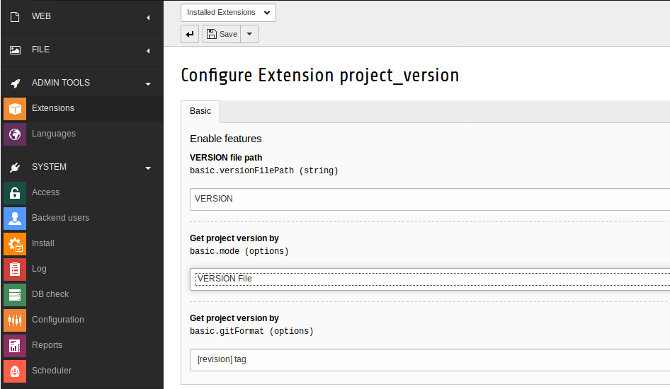
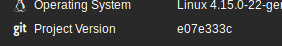
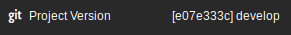
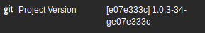
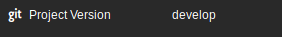
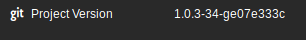

# Project Version (EXT:project_version)  

## What is project version?
Project version is a TYPO3  extension that adds an entry to the TYPO3 system information in the toolbar. This entry is based either on the common 'VERSION' file or on the local GIT revision.

## How do I install it? 
First make sure you match the requirements:

| Requirement | Version |
| --- | --- |
| TYPO3 | \>= 8.7.0 \<=8.7.19 |
| php | \>= 7.0 |

### Composer (recommended)
Simply require the extension from packagist: 
`composer require kamiyang/ext-projectversion`

Or if you prefer typo3-ter:
`composer require typo3-ter/projectversion`

### GIT
Go into your `typo3conf/ext/` folder and clone the project directly from github:
`git clone git@github.com:KamiYang/project_version.git`

You now only have to manually activate the extension in your Extension Manager.

## How do I use it?
### "VERSION"-file
Now, this is the easiest part. Create a file called `VERSION` (case sensitive) in your TYPO3 frontend docroot with the project version. This can be done like this: 
`/var/www/html$ echo 1.0.0-rc.3 > VERSION`

### Custom Path
You can use your own filename and path. Note that this path still has to be accessible from your web docroot.
The configuration can be done in the ExtensionConfiguration. It is also possible to change the directory of the 'VERSION'-file. Only provide a directory path (with trailing slash '/') and it will automatically search for an file called 'VERSION'.

Examples:
We assume that the web document root (`PATH_site`) is `/var/www/html`.

| Configured Path | Absolute filename | 
| --- | --- |
| (empty - default) | /var/www/html/VERSION |
| MyVersion | /var/www/html/MyVersion |
| typo3conf/ | /var/www/html/typo3conf/VERSION |
| ./My/Custom/Version/File/In/Some/Nested/File/Structure | /var/www/html/./My/Custom/Version/File/In/Some/Nested/File/Structure|

### GIT
Since release 0.3.0 git is supported. This must be manually activated. In order to use git, make sure it's available!
Common case is that the local development environment is based on docker images. Many docker images do not have git available.
To activate it, simply move via your preferred web browser into the TYPO3 backend. Go to "Extensions > Project Version" and configure the extension.
The configuration screen will look like this on default: 

#### Configuration possibilities

##### basic.mode

| Configuration | Description |
| --- | --- |
| VERSION File (default)| Fetches the current project version based on the path configured in `basic.versionFilePath` |
| GIT | Uses GIT if available to resolve the project version in the format configured in `basic.gitFormat` |
| GIT (VERSION file as fallback) | Will use GIT as preferred resolving method. If not available will fallback to VERSION file. |

##### basic.gitFormat

| Configuration | Description | Example |
| --- | --- | --- |
| Revision | Will only fetch the revision as project version |  |
| \[revision] Branch (default) | Will fetch the current revision and branch |  | 
| \[revision] Tag | Will fetch the current revision and tag |  | 
| Branch | Will only fetch the current branch |  |
| Tag | Will only fetch the current tag |  | 

## Roadmap to v1.0.0
 
 - [x] Static VERSION file support
 - [x] Add ability to configure "VERSION"-file path
 - [x] GIT revision support
 - [x] GIT tag/branch based on revision support
 - [ ] Add documentation of this extensions features
 - [x] Upload extension to packagist.org
 - [x] Upload extension to TER

### Milestone for v0.4.0
The next milestone is the documentation of various use cases and possibilities and achieve a higher coverage. Current coverage is about ~70%. 
