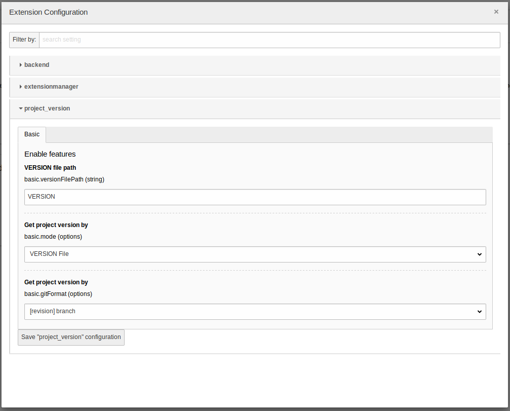

# Project Version (EXT:project_version)

## What is project version?
Project version is a TYPO3  extension that adds an entry to the TYPO3 system information in the toolbar. This entry is based either on the common 'VERSION' file or on the local GIT revision.

## How do I install it? 
First make sure you match the requirements:

| Requirement | Version |
| --- | --- |
| TYPO3 | \>=8.7 <9.6 |
| php | \>= 7.0 |

### Composer
Simply require the extension from packagist: 
`composer require kamiyang/ext-projectversion`

Or if you prefer typo3-ter:
`composer require typo3-ter/projectversion`

### TER
No composer available? No problem! You also can find this extension at TYPO3's Extension Repository (TER).
You can straight download it from inside your TYPO3 as long, as your TYPO3 is not in composer mode. 

## How do I use it?
### "VERSION"-file
Now, this is the easiest part. Create a file called `VERSION` (case sensitive) in your TYPO3 frontend docroot with the project version. This can be done like this: 
`$ echo 1.0.0-rc.3 > /var/www/html/VERSION`

### Custom Path
You can use your own filename and path. Note that this path still has to be accessible from your web docroot.
The configuration can be done in the ExtensionConfiguration. It is also possible to change the directory of the 'VERSION'-file. Only provide a directory path (with trailing slash '/') and it will automatically search for an file called 'VERSION'.

Examples:
We assume that the web document root (`PATH_site`) is `/var/www/html`.

| Configured Path | Absolute filename | 
| --- | --- |
| (empty - default) | /var/www/html/VERSION |
| MyVersion | /var/www/html/MyVersion |
| typo3conf/ | /var/www/html/typo3conf/VERSION |
| ./My/Custom/Version/File/In/Some/Nested/File/Structure | /var/www/html/./My/Custom/Version/File/In/Some/Nested/File/Structure|

### GIT
Since release 0.3.0 git is supported. This must be manually activated. In order to use git, make sure it's available!
Common case is that the local development environment is based on docker images. Many docker images do not have git out of the box available.
To activate it, simply move via your preferred web browser into the TYPO3 backend. For TYPO3 v8.7 - go to "Extensions > Project Version" and configure the extension.
The configuration screen will look like this on default: 

This has changed a bit in TYPO3 v9. To configure the extension go to "Settings > Configure extensions" and filter for "project version".
The new configuration screen will look like this:

#### Configuration possibilities

##### basic.mode

| Configuration | Description |
| --- | --- |
| VERSION File (default)| Fetches the current project version based on the path configured in `basic.versionFilePath` |
| GIT | Uses GIT if available to resolve the project version in the format configured in `basic.gitFormat` |
| GIT (VERSION file as fallback) | Will use GIT as preferred resolving method. If not available will fallback to VERSION file. |

##### basic.gitFormat

| Configuration | Description | Example |
| --- | --- | --- |
| Revision | Will only fetch the revision as project version |  |
| \[revision] Branch (default) | Will fetch the current revision and branch |  | 
| \[revision] Tag | Will fetch the current revision and tag |  | 
| Branch | Will only fetch the current branch |  |
| Tag | Will only fetch the current tag |  | 

## Roadmap to v1.0.0
 
 - [x] Static VERSION file support
 - [x] Add ability to configure "VERSION"-file path
 - [x] GIT revision support
 - [x] GIT tag/branch based on revision support
 - [ ] Add documentation of this extensions features
 - [x] Upload extension to packagist.org
 - [x] Upload extension to TER
 - [x] Support TYPO3 v9.4
 - [x] Support TYPO3 v9 LTS
 - [x] Achieve overall test coverage above 95%  
 - [x] Configure [TravisCI](https://travis-ci.org/KamiYang/project_version)
 - [x] Configure [StyleCI](https://github.styleci.io/repos/134700322)
 - [x] Configure [Coveralls](https://coveralls.io/github/KamiYang/project_version)
 - [x] Static VERSION value via extension configuration

### Milestone for v0.6.0
 - Ability to "hardcode" static project version via the TYPO3 backend

## Note
The TYPO3 v8 version of this extension will not be maintained after release 1.0.0! But this should be no problem because TYPO3 v8 only gets bugfixes.
This means, version 1.0.0 should stay compatible with all further TYPO3 v8 releases!

After releasing version 1.0.0, which will be around the release of the first TYPO3 v9 LTS version, EXT:project_version will be refactored to php7.2 and will integrate TYPO3 v9 features.
